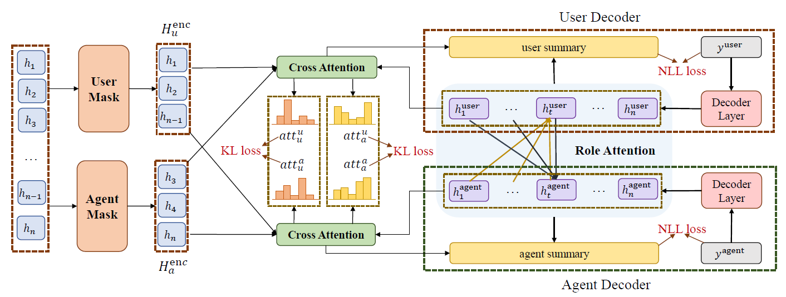

# RODS

The official repository for ACL 2022 main conference paper: [Other Roles Matter! Enhancing Role-Oriented Dialogue Summarization via Role Interactions](https://aclanthology.org/2022.acl-long.182/).

## Instructions

### 1. Introduction

We propose two role interaction methods to enhance the role-oriented dialogue summarization task. Two methods include **cross attention interaction** and **decoder self-attention interaction**. The cross attention interaction adopts an attention divergence loss to let each role decoder attend to the most useful utterances from other roles. The decoder self-attention interaction adopts the interactive decoding strategy to consider other roles' summaries when generating summaries.

We experiment on two datasets ([CSDS](https://github.com/xiaolinAndy/CSDS) and [MC](https://github.com/cuhksz-nlp/HET-MC)), and two baseline methods ([PGN]() and [BERTAbs](https://github.com/nlpyang/PreSumm)).



### 2. Necessary Resources

- CSDS dataset: Please refer to the [original repository](https://github.com/xiaolinAndy/CSDS) for downloading the dataset
- MC dataset:  Please refer to the process provided by the [original repository](https://github.com/cuhksz-nlp/HET-MC). (Due to the website policy, we are unable to directly provide the processed data. However, we provide the splits of urls for train, val and test datasets in [data/MC/](data/MC/))
- Pretrained BERT model: We use the base version of Chinese BERT-wwm, available at [here](https://github.com/ymcui/Chinese-BERT-wwm).
- Tencent embeddings: If you want to train on other Chinese dataset for PGN-based model, you need to extract the pretrained embeddings through tencent embeddings, available at [here](https://ai.tencent.com/ailab/nlp/en/embedding.html).

### 3. Usage

#### Requirements

- python == 3.7
- pytorch == 1.8
- files2rouge == 2.1.0
- jieba == 0.42.1
- numpy == 1.19.1
- tensorboard == 2.3.0
- tensorboardx == 2.1
- cytoolz == 0.11.0
- nltk == 3.5
- bert-score == 0.3.6
- moverscore == 1.0.3
- transformers == 3.3.1

#### Instruction for PGN interact

1. Go to the *models/PGN_interact/* directory.

2. Download the CSDS/MC dataset, and put the data under the folder *data/CSDS* or *data/MC*.

3. If you want to extract the pretrained embeddings, download the [tencent embedding](https://ai.tencent.com/ailab/nlp/en/embedding.html) and put it under the *../pretrained/* folder, else you could use our provided extracted embeddings and pass this step.

   For MC dataset, the extracted embeddings are a bit large and you could download it through:

   - google drive: https://drive.google.com/file/d/1KsaY0ErkyJwJY1hndbX7XzJp5lrQkeYm/view?usp=sharing

   - baidudisk：https://pan.baidu.com/s/1_LDNFvd5AGocalWkYcv57Q password: 5d1o

   After downloading, please put it under the *models/PGN_interact/data_utils/embeddings* folder

4. Run the bash file *run_CSDS.sh* or *run_MC.sh* to train and test.

#### Instruction for BERTAbs interact

1. Go to the *models/BERT_interact/* directory.
2. Download the CSDS/MC dataset, and put the data under the folder *data/CSDS* or *data/MC*.
3. Download the Chinese [BERT-wwm](https://github.com/ymcui/Chinese-BERT-wwm) pretrained models, create a new folder named *bert_base_chinese/*  and put it under the folder *../pretrained/*.
4. Run the bash file *run_CSDS.sh* or *run_MC.sh* to train and test.

#### Evaluation

1. We put the output of our trained models to the *results/* folder. If you have trained your models, you could also put the outputs into the folder.
2. Run *evaluate/evaluate.py* to evaluate through automatic metrics. Pay attention to change the file names if you want to test your own output.

#### Our pretrained Checkpoints

We also provide some checkpoints for **PGN-both** and **BERT-both**. You could download them through the following links:

- PGN for CSDS:
  - google drive: https://drive.google.com/file/d/1kIj7saeTXtM0ekMtLZFfFC09nSX3xBvk/view?usp=sharing
  - baidudisk: https://pan.baidu.com/s/18jAuOn8feWZfkDozQvpAjA password: otkj
- BERT-both for CSDS:
  - google drive: https://drive.google.com/file/d/1w9tDeP5WnJFXBdRV6KjCyrf33n0Tw_bv/view?usp=sharing
  - baidudisk: https://pan.baidu.com/s/1YZRVfo3ToUG33DryJumw1A  password: bjiu
- PGN for MC:
  - google drive: https://drive.google.com/file/d/1PyYqiTh8mSbHBfkZZbbGEbh9Clhmo5Dy/view?usp=sharing
  - baidudisk: https://pan.baidu.com/s/1GIHHPwx33rs3xOOzvGR6xQ password: rdyk
- BERT-both for MC:
  - google drive: https://drive.google.com/file/d/1kRM11BBIj1QR4A5Eo444BzQ3J_iagCwN/view?usp=sharing
  - baidudisk: https://pan.baidu.com/s/1BeBBikZk3m7nuIP5jgIMVg password: grkc

### 4. Acknowledgement

The reference code of the provided methods are:

- [PGN](https://github.com/atulkum/pointer_summarizer)
- [BERTAbs](https://github.com/nlpyang/PreSumm)

We thanks for all these researchers who have made their codes publicly available.

### 5. Citation

If you want to cite our paper, please use this ACL proceeding bibtex version:
```
@inproceedings{lin-etal-2022-roles,
    title = "Other Roles Matter! Enhancing Role-Oriented Dialogue Summarization via Role Interactions",
    author = "Lin, Haitao  and
      Zhu, Junnan  and
      Xiang, Lu  and
      Zhou, Yu  and
      Zhang, Jiajun  and
      Zong, Chengqing",
    booktitle = "Proceedings of the 60th Annual Meeting of the Association for Computational Linguistics (Volume 1: Long Papers)",
    month = may,
    year = "2022",
    address = "Dublin, Ireland",
    publisher = "Association for Computational Linguistics",
    url = "https://aclanthology.org/2022.acl-long.182",
    pages = "2545--2558",
    abstract = "Role-oriented dialogue summarization is to generate summaries for different roles in the dialogue, e.g., merchants and consumers. Existing methods handle this task by summarizing each role{'}s content separately and thus are prone to ignore the information from other roles. However, we believe that other roles{'} content could benefit the quality of summaries, such as the omitted information mentioned by other roles. Therefore, we propose a novel role interaction enhanced method for role-oriented dialogue summarization. It adopts cross attention and decoder self-attention interactions to interactively acquire other roles{'} critical information. The cross attention interaction aims to select other roles{'} critical dialogue utterances, while the decoder self-attention interaction aims to obtain key information from other roles{'} summaries. Experimental results have shown that our proposed method significantly outperforms strong baselines on two public role-oriented dialogue summarization datasets. Extensive analyses have demonstrated that other roles{'} content could help generate summaries with more complete semantics and correct topic structures.",
}
```


If you have any issues, please contact with haitao.lin@nlpr.ia.ac.cn

